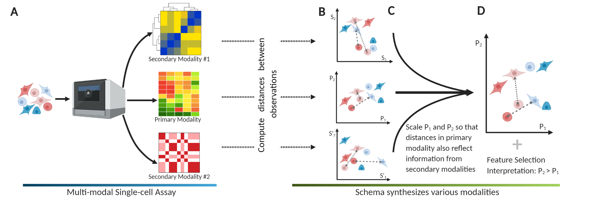

Overview
========

Schema is a general algorithm for integrating heterogeneous data
modalities. While it has been specially designed for multi-modal
single-cell biological datasets, it should work in other multi-modal
contexts too.

 

 
Schema is designed for single-cell assays where multiple modalities have
been *simultaneously* measured for each cell. For example, this could be
simultaneously-asayed scRNA-seq and scATAC-seq data, or a
spatial-transcriptomics dataset (e.g. 10x Visium, Slideseq or
STARmap). Schema can also be used with just a scRNA-seq dataset where some
per-cell metadata is available (e.g., cell age, donor information, batch
ID etc.). With this data, Schema can help perform analyses like:

  * Characterize cells that look similar transcriptionally but differ
    epigenetically, identifying genes that are differentially expressed
    in them.

  * Improve cell-type inference by combining RNA-seq and ATAC-seq data.

  * In spatially-resolved single-cell data, identify differentially
    expressed genes (DEGs) specific to a spatial pattern (e.g., DEGs in
    normal cells near a tumor cell).

  * Simultaneously account for batch information while also integrating
    other modalities. For example, Schema can help identify gene whose
    expression varies across developmental stages *and* is robust across
    replicates.

  * **Improved visualizations**: tune t-SNE or UMAP plots to more clearly
    arrange cells along a desired manifold. Schema helps you do this by
    infusing just enough of the desired information into scRNA-seq data
    so that it shows up in the visualization but not distort the original
    expression data so much that the initial layout is destroyed. 

To integrate multi-modal data, Schema takes a * `metric learning`_ *
approach. Each modality is interepreted as a multi-dimensional space, with
observations mapped to points in it (**B** in figure above). We associate
a distance metric with each modality; the metric reflects what it means
for cells to be similar under that modality. For example, Euclidean
distances between L2-normalized expression vectors are a proxy for
coexpression. Across the three graphs in the figure above, the dashed and
dotted lines indicate distances between the same pairs of
observations. Our goal is to produce a new representation where the
distances between points is informed jointly by all the modalities.

In Schema, you start by designating one high-confidence modality as the
primary (i.e., reference) and the remaining modalities as secondary. In
many cases, scRNA-seq is a good choice for the primary modality, with
other modalities providing independent insight into how
transcriptionally-similar cells might vary. Schema transforms the
primary-modality space by scaling each dimension so that the distances in
the transformed space have a higher (or lower, as desired) correlation
with corresponding distances in the secondary modalities (**C,D** in the
figure above). In generating such a shared-space representation, Schema is
similar to classical approaches like CCA (canonical correlation analysis)
or deep-learning methods like autoencoders (which maps multiple
representations into a shared space). Schema differs from these approaches
in the following way:

  * Constrained transformation:

  * Interpretability:

  * Speed and flexibiility:

; arbitrary distance metrics are allowed for the latter. Importantly, the transformation is provably guaranteed to limit the distortion of the original space, thus ensuring that information in the primary modality is preserved. (D) The new point locations represent information synthesized from multiple modalities into a coherent structure. To compute the transformation, Schema weights features in the primary modality by their importance to its objective; we have found this feature-selection aspect very useful in biological interpretation of its results.
	 

Basic Usage
~~~~~~~~~~~

.. code-block:: Python

    from schema import SchemaQP

:Example: Correlate gene expression with developmental stage. We demonstrate use with Anndata objects here.
.. code-block:: Python

    sqp = SchemaQP() # initialize with default params (min_corr = 0.99)
    mod_X = sqp.fit_transform( adata.X, [ adata.obs['stage'] ]) # correlate the gene expression with the 'stage' parameter
    gene_wts = sqp.feature_weights() # get a ranking of gene wts important to the correlation

:Example: Correlate gene expression with three secondary modalities.
.. code-block:: Python

    sqp = SchemaQP(min_corr = 0.9) # lower than the default, allowing greater distortion of the primary modality 
    sqp.fit( adata.X,    
                 [ adata.obs['col1'], adata.obs['col2'], adata.obsm['Matrix1'] ], 
                 [ "categorical", "numeric", "feature_vector"]) # data types of the three modalities
    mod_X = sqp.transform( adata.X) # transform
    gene_wts = sqp.feature_weights() # get gene importances

:Example: Correlate gene expression 1) positively with ATAC-Seq data and 2) negatively with Batch information::
.. code-block:: Python

    atac_30d = sklearn.decomposition.TruncatedSVD(50).fit_transform( atac_cnts_sp_matrix)
    sqp = SchemaQP(min_corr=0.9)
    # df is a pd.DataFrame, srs is a pd.Series, -1 means try to disagree
    mod_X = sqp.fit_transform( df_gene_exp, # gene expression dataframe
                               [ atac_30d, batch_id],  # batch_info can be a Pandas Series or numpy array
                               [ 'feature_vector', 'categorical'], 
                               [ 1, -1]) # maximize combination of (agreement with ATAC-seq + disagreement with batch_id)
    gene_wts = sqp.feature_weights() # get gene importances

Schema is described in the paper “Schema: metric learning enables
interpretable synthesis of heterogeneous single-cell modalities" 
(http://doi.org/10.1101/834549)

Source code available at: https://github.com/rs239/schema

.. _metric learning: https://en.wikipedia.org/wiki/Similarity_learning#Metric_learning
