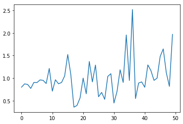
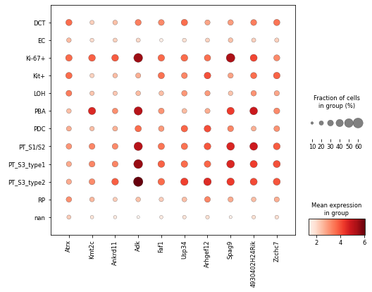
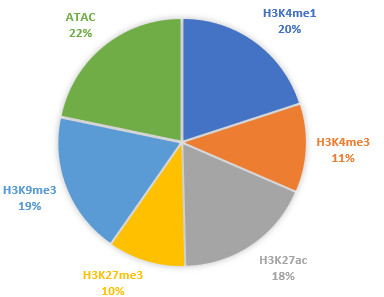
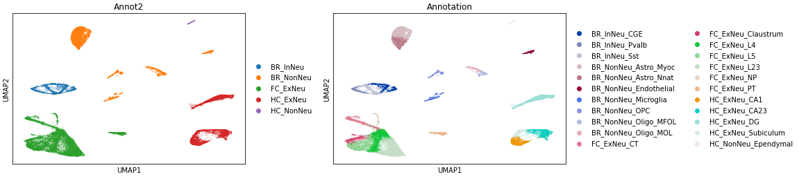
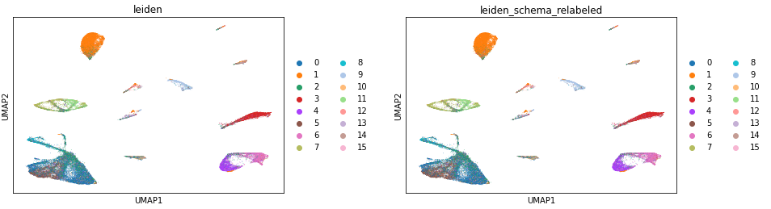
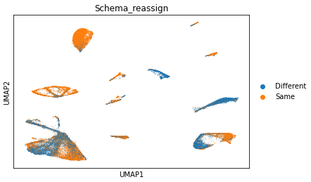
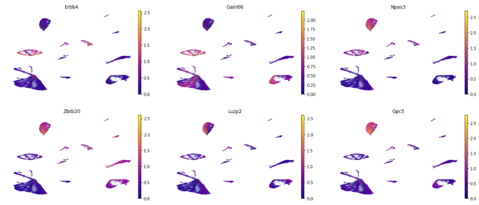

Data Integration Examples
=======

API-usage Examples
~~~~~~~~~~~~~~

*Note*: The code snippets below show how Schema could be used for hypothetical datasets and illustrates the API usage. In the next sections (`Paired RNA-seq and ATAC-seq`_, `Paired-Tag`_) and in `Visualization`_, we describe worked examples where we also provide the dataset to try things on. We are working to add more datasets.

**Example** Correlate gene expression 1) positively with ATAC-Seq data and 2) negatively with Batch information.
  
.. code-block:: Python

    atac_50d = sklearn.decomposition.TruncatedSVD(50).fit_transform( atac_cnts_sp_matrix)
    
    sqp = SchemaQP(min_corr=0.9)
    
    # df is a pd.DataFrame, srs is a pd.Series, -1 means try to disagree
    mod_X = sqp.fit_transform( df_gene_exp, # gene expression dataframe: rows=cells, cols=genes
                               [ atac_50d, batch_id],  # batch_info can be a pd.Series or np.array. rows=cells
                               [ 'feature_vector', 'categorical'], 
                               [ 1, -1]) # maximize combination of (agreement with ATAC-seq + disagreement with batch_id)
			       
    gene_wts = sqp.feature_weights() # get gene importances

 
**Example** Correlate gene expression with three secondary modalities.

.. code-block:: Python

    sqp = SchemaQP(min_corr = 0.9) # lower than the default, allowing greater distortion of the primary modality 
    sqp.fit( adata.X,    
             [ adata.obs['col1'], adata.obs['col2'], adata.obsm['Matrix1'] ], 
             [ "categorical", "numeric", "feature_vector"]) # data types of the three modalities
    mod_X = sqp.transform( adata.X) # transform
    gene_wts = sqp.feature_weights() # get gene importances

Paired RNA-seq and ATAC-seq
~~~~~~~~~~~~~~~~~~~~~~~~~~~

Here, we integrate simultaneously assayed RNA- and ATAC-seq data from `Cao et al.'s`_ sci-CAR study of mouse kidney cells. Specifically, we'll try to do better cell-type inference by considering both RNA-seq and ATAC-seq data simultaneously. The original study has ground-truth labels for most of the cell types, allowing us to benchmark automatically-computed clusters (generated by Leiden clustering here). As we'll show, a key challenge here is that the ATAC-seq data is very sparse and noisy. Naively incorporating it with RNA-seq can actually be counter-productive--- the joint clustering from a naive approach can actually have a *lower* overlap with the ground truth labels than if we were to just use RNA-seq-based clustering.  

*Note*: This example involves generating Leiden clusters; you will need to install the *igraph* and *leidenalg* Python packages if you want to use them:

.. code-block:: bash

    pip install igraph
    pip install leidenalg

Let's start by getting the data. We have preprocessed the original dataset, done some basic cleanup, and put it into an AnnData object that you can download. Please remember to also cite the original study if you use this dataset.
   
.. code-block:: Python

    import schema
    adata = schema.datasets.scicar_mouse_kidney()
    print(adata.shape, adata.uns['atac.X'].shape)
    print(adata.uns.keys())

As you see, we have stored the ATAC data (as a sparse numpy matrix) in the .uns slots of the anndata object. Also look at the *adata.obs* dataframe which has t-SNE coordinates, ground-truth cell type names (as assigned by Cao et al.) and cluster colors etc. You'll notice that some cells don't have ground truth assignments. When evaluating, we'll skip those.

To use the ATAC-seq data, we reduce its dimensionality to 50. Instead of PCA, we apply *TruncatedSVD* since the ATAC counts matrix is sparse.

.. code-block:: Python
   
    svd2 = sklearn.decomposition.TruncatedSVD(n_components= 50, random_state = 17)
    H2 = svd2.fit_transform(adata.uns["atac.X"])

Next, we run Schema. We choose RNA-seq as the primary modality because 1) it has lower noise than ATAC-seq, and 2) we want to investigate which of its features (i.e., genes) are important during the integration. We will first perform a NMF transformation on the RNA-seq data. For the secondary modality, we'll use the dimensionality-reduced ATAC-seq. We require a positive correlation  between the two (`secondary_data_wt_list = [1]` below). **Importantly, we force Schema to generate a low-distortation transformation** : the correlation of distances between original RNA-seq space and the transformed space, `min_desired_corr` is required to be >99%. This low-distortion capability of Schema is crucial here, as we'll demonstrate.

In the `params` settings below, the number of randomly sampled point-pairs has been bumped up to 5M (from default=2M). It helps with the accuracy and doesn't cost too much computationally. We also turned off `do_whiten` (default=1, i.e., true). When `do_whiten=1`, Schema first rescales the PCA/NMF transformation so that each axis has unit variance; typically, doing so is "nice" from a theoretical/statistical perspective. But it can interfere with downstream analyses (e.g., Leiden clustering here).

.. code-block:: Python
		
    sqp99 = schema.SchemaQP(0.99, mode='affine', params= {"decomposition_model":"nmf", 
							  "num_top_components":50,
							  "do_whiten": 0,
							  "dist_npairs": 5000000})
    dz99 = sqp99.fit_transform(adata.X, [H2], ['feature_vector'], [1])

Let's look at the feature weights. Since we ran the code in 'affine' mode, the raw weights from the quadratic program will correspond to the 50 NMF factors. Three of these factors seem to stand out; most other weights are quite low.

.. code-block:: Python
		
    plt.plot(sqp99._wts)

    
Schema offers a helper function to convert these NMF (or PCA) feature weights to gene weights. The function offers a few ways of doing so, but the default is to simply average the loadings across the top-k factors:

.. code-block:: Python

    v99 = sqp99.feature_weights("top-k-loading", 3)

Let's do a dotplot to visualize how the expression of these genes varies by cell name. We plot the top 10 genes by importance here.

.. code-block:: Python

    dfv99 = pd.DataFrame({"gene": adata.var_names, "v":v99}).sort_values("v", ascending=False).reset_index(drop=True)
    sc.pl.dotplot(adata, dfv99.gene.head(10).tolist(),'cell_name_short', figsize=(8,6))

As you'll notice, theese gene seem to be differentially expressed in PT cells, PBA and Ki-67+ cells. Essentially, these are cell types where ATAC-seq data was most informative. As we'll see shortly, it is preciely in these cells where Schema is able to offer the biggest improvement.

For a comparison later, let's also do a Schema run without a strong distortion control. Below, we set the `min_desired_corr` parameter to 0.10 (i.e., 10%). Thus, the ATAC-seq data will get to influence the transformation a lot more.

.. code-block:: Python

     sqp10 = schema.SchemaQP(0.10, mode='affine', params= {"decomposition_model":"nmf", 
							   "num_top_components":50, 
							   "do_whiten": 0,
							   "dist_npairs": 5000000})
     dz10 = sqp10.fit_transform(adata.X, [H2], ['feature_vector'], [1])		 
     
    
Finally, let's do Leiden clustering of the RNA-seq, ATAC-seq, and the two Schema runs. We'll compare the cluster assignments to the ground truth cell labels. Intuitively, by combining RNA-seq and ATAC-seq, one should be able to get a more biologically accurate clustering. We visually evaluate the clusterings below; in the paper, we've supplemented this with more quantitative estimates.

.. code-block:: Python

    import schema.utils
    fcluster = schema.utils.get_leiden_clustering #feel free to try your own clustering algo

    ld_cluster_rna = fcluster(sqp99._decomp_mdl.transform(adata.X.todense()))
    ld_cluster_atac = fcluster(H2)
    ld_cluster_sqp99 = fcluster(dz99)
    ld_cluster_sqp10 = fcluster(dz10)
    
   
.. code-block:: Python
		
    x = adata.obs.tsne_1
    y = adata.obs.tsne_2
    idx = adata.obs.rgb.apply(lambda s: isinstance(s,str) and '#' in s).values.tolist() #skip nan cells

    fig, axs = plt.subplots(3,2, figsize=(10,15))
    axs[0][0].scatter(x[idx], y[idx], c=adata.obs.rgb.values[idx], s=1)
    axs[0][0].set_title('Ground Truth')
    axs[0][1].scatter(x[idx], y[idx], c=adata.obs.rgb.values[idx], s=1, alpha=0.1)
    axs[0][1].set_title('Ground Truth Labels')
    for c in np.unique(adata.obs.cell_name_short[idx]):
	if c=='nan': continue
	cx,cy = x[adata.obs.cell_name_short==c].mean(), y[adata.obs.cell_name_short==c].mean()
	axs[0][1].text(cx,cy,c,fontsize=10)
    axs[1][0].scatter(x[idx], y[idx], c=ld_cluster_rna[idx], cmap='tab20b', s=1)
    axs[1][0].set_title('RNA-seq')
    axs[1][1].scatter(x[idx], y[idx], c=ld_cluster_atac[idx], cmap='tab20b', s=1)
    axs[1][1].set_title('ATAC-seq')
    axs[2][0].scatter(x[idx], y[idx], c=ld_cluster_sqp99[idx], cmap='tab20b', s=1)
    axs[2][0].set_title('Schema-99%')
    axs[2][1].scatter(x[idx], y[idx], c=ld_cluster_sqp10[idx], cmap='tab20b', s=1)
    axs[2][1].set_title('Schema-10%')

    for ax in np.ravel(axs): ax.axis('off')

   

Below, we show the figures in a 3x2 panel of t-SNE plots. In the first row, the left panel shows the cells colored by ground-truth cell types; the right panel is basically the same but lists the cell types explicitly. The next row shows cells colored by RNA- or ATAC-only clustering. Notice how noisy the ATAC-only clustering is! This is not a bug in our analysis-- less than 0.3% of ATAC count matrix entries are non-zero and the sparsity of the ATAC data makes it difficult to produce high-quality cell type estimates.

The third row shows cells colored by Schema-based clustering at 99% (left) and 10% (right)  `min_desired_corr` thresholds. With Schema at a low-distortion setting (i.e., `min_desired_corr = 99%`), notice that PT cells and Ki-67+ cells, circled in red, are getting more correctly classified now. This improvement of the Schema-implied clustering over the RNA-seq-only clustering can be quantified by measuring the overlap with ground truth cell grouping, as we do in the paper.

**This is a key strength of Schema** --- even with a modality that is sparse and noisy (like ATAC-seq here), it can nonetheless extract something of value from the noisy modality because the constraint on distortion of the primary modality acts as a regularization. This is also why we recommend that your highest-confidence modality be set as the primary. Lastly as demonstration, if we relax the distortion constraint by setting `min_desired_corr = 10%`, you'll notice that the noise of ATAC-seq data does swamp out the RNA-seq signal. With an unconstrained approach (e.g., CCA or some deep learning approaches), this ends being a major challenge.

 .. image:: ../_static/schema_atacrna_demo_tsne1.png
   :width: 600

Paired-Tag
~~~~~~~~~~~~~~~~~~~~~~~~~~~

Here we synthesize simultaneously assayed RNA-seq, ATAC-seq and histone-modification data at a single-cell resolution, from the Paired-Tag protocol described in `Zhu et al.’s study`_ of adult mouse frontal cortex and hippocampus (Nature Methods, 2021). This is a fascinating dataset with five different histone modifications assayed separately (3 repressors and 2 activators), in addition to RNA-seq and ATAC-seq. As in the original study, we consider each of the histone modifications as a separate modality, implying a hepta-modal assay! 

Interestingly, though, the modalities are available only in pairwise combinations with RNA-seq: some cells were assayed for H3K4me1 & RNA-seq while another set of cells provided ATAC-seq & RNA-seq data, and so on. Here’s the overall distribution of non-RNA-seq modalities across 64,849 cells. 

This organization of data might be tricky to integrate with a method which expects *each* modality to be available for *all* cells and has difficulty accomodating partial coverage of some modalities.  Of course, you could always fall back to an integrative approach that treats each modality’s cell population as independent, but then you miss out on the simultaneously-multimodal aspect of this data. 

With Schema, you can have your cake and eat it too! We do 6 two-way integrations (RNA-seq as the primary modality against each of the other modalities) using the subsets of cells available in each case. Schema’s interpretable and linear framework makes it easy to combine these. Once Schema computes the optimal transformation of RNA-seq that aligns it with, say, ATAC-seq, we apply that transformation to the entire RNA-seq dataset, including cells that do *not* have ATAC-seq data.

Such full-dataset extensions of the pairwise syntheses can then be stacked together. Doing Leiden clustering on the result would enable us to infer cell types by integrating information from all modalities. As we will show below, Schema's synthesis helps improve the quality of cell type inference over what you could get just from RNA-seq. Similarly for feature selection, Schema's computed feature weights for each two-way synthesis can be averaged to get the genes important to the overall synthesis. In a completely automated fashion and without any knowledge of tissue’s source or biology, we’ll find that the genes Schema identifies as important turn out to be very relevant to neuronal function and disease. Ready for more?

First, you will need the data. The original is available on GEO (`GSE152020`_) but the individual modalities are huge (e.g., the ATAC-seq peak-counts are in a 14,095 x 2,443,832 sparse matrix!). This is not unusual--- epigenetic modalites are typically very sparse (we discuss why this matters in `Paired RNA-seq and ATAC-seq`_). As a preprocessing step, we performed singular value decompositions (SVD) of these modalities and also reduced the RNA-seq data to its 4,000 highly variable genes. An AnnData object with this preprocessing is available here (please remember to also cite the original study if you use this dataset) :

.. code-block:: bash

    wget http://cb.csail.mit.edu/cb/schema/adata_dimreduced_paired-tag.pkl

Let's load it in: 
   
.. code-block:: Python

    import schema, pickle, anndata, sklearn.metrics
    import scanpy as sc

    # you may need to change the file location as appopriate to your setup
    adata = pickle.load(open("adata_dimreduced_paired-tag.pkl", "rb")) 

    print (adata.shape,
	   [(c, adata.uns['SVD_'+c].shape) for c in adata.uns['sec_modalities']])

	   
As you see, we have stored the 50-dimensional SVDs of the secondary modalities in the :code:`.uns` slots of the anndata object. Also look at the :code:`adata.obs` dataframe which has UMAP coordinates, ground-truth cell type names (as assigned by Zhu et al.) etc.

We now do Schema runs for the 6 two-way modality combinations, with RNA-seq as the primary in each run. Each run will also store the transformation on the entire 64,849-cell RNA-seq dataset and also store the gene importances.

   
.. code-block:: Python

    d_rna = adata.X.todense()

    desc2transforms = {}
    for desc in adata.uns['sec_modalities']:
	print(desc)
	
	# we mostly stick with the default settings, explicitly listed here for clarity
	sqp = schema.SchemaQP(0.99, mode='affine', params= {"decomposition_model": 'pca',
							    "num_top_components":50,
							    "do_whiten": 0, # this is different from default
							    "dist_npairs": 5000000})
							    
        # extract the relevant subset
	idx1 = adata.obs['rowidx'][adata.uns["SVD_"+desc].index]
	prim_d = d_rna[idx1,:]
	sec_d = adata.uns["SVD_"+desc].values
	print(len(idx1), prim_d.shape, sec_d.shape)
	
	sqp.fit(prim_d, [sec_d], ['feature_vector'], [1]) # fit on the idx1 subset...
	dz = sqp.transform(d_rna)  # ...then transform the full RNA-seq dataset
	
	desc2transforms[desc] = (sqp, dz, idx1, sqp.feature_weights(k=3))

**Cell type inference:**: In each of the 6 runs above, :code:`dz` is a 64,849 x 50 matrix. We can horizontally stack these matrices for a 64,849 x 300 matrix that represents the transformation of RNA-seq data informed simultaneously by all 6 secondary modalities. 
   
.. code-block:: Python

    a6Xpca = np.hstack([dz for  _,dz,_,_ in desc2transforms.values()])
    adata_schema = anndata.AnnData(X=a6Xpca, obs=adata.obs)
    print (adata_schema.shape)

We then perform Leiden clustering on the original and transformed data, computing the overlap with expert marker-gene-based annotation by Zhu et al.

   
.. code-block:: Python

    # original
    sc.pp.pca(adata)
    sc.pp.neighbors(adata)
    sc.tl.leiden(adata)

    # Schema-transformed
    # since Schema had already done PCA before it transformed, let's stick with its raw output 
    sc.pp.neighbors(adata_schema, use_rep='X')
    sc.tl.leiden(adata_schema)

    # we'll do plots etc. with the original AnnData object
    adata.obs['leiden_schema'] = adata_schema.obs['leiden'].values

    # compute overlap with manual cell type annotations
    ari_orig  =  sklearn.metrics.adjusted_rand_score(adata.obs.Annotation, adata.obs.leiden)
    ari_schema=  sklearn.metrics.adjusted_rand_score(adata.obs.Annotation, adata.obs.leiden_schema)

    print ("ARI: Orig: {} With Schema: {}".format( ari_orig, ari_schema))

    
As you can see, the ARI with Schema improved from 0.437 (using only RNA-seq) to 0.446 (using all modalities). Single-cell epigenetic modalities are very sparse, making it difficult to distinguish signal from noise. However, Schema's constrained approach allows it to extract signal from these secondary modalities nonetheless, a task which has otherwise been challenging (see the related discussion in our `paper`_ or in `Paired RNA-seq and ATAC-seq`_).

Before we plot these clusters, we'll relabel the Schema-based Leiden clusters to match the labeling of RNA-seq only Leiden clusters; this will make their color schemes consistent. You will need to install the Python package *munkres* (:code:`pip install munkres`) for the related computation.

   
.. code-block:: Python

    import munkres
    list1 = adata.obs['leiden'].astype(int).tolist()
    list2 = adata.obs['leiden_schema'].astype(int).tolist()

    contmat = sklearn.metrics.cluster.contingency_matrix(list1, list2)
    map21 = dict(munkres.Munkres().compute(contmat.max() - contmat))
    adata.obs['leiden_schema_relabeled'] = [str(map21[a]) for a in list2]
    adata.obs['Schema_reassign'] = [('Same' if (map21[a]==a) else 'Different') for a in list2]

    for c in ['Annotation','Annot2', 'leiden', 'leiden_schema_relabeled', 'Schema_reassign']:
	sc.pl.umap(adata, color=c)

	   
	
It's also interesting to identify cells where the cluster assignments changed after multi-modal synthesis. As you can see, it's only in certain cell types where the epigenetic data suggests a different clustering than the primary RNA-seq modality.

**Gene set identification:**  The feature importances output by Schema here identify the genes whose expression variations best agree with epigenetic variations in these tissues. We first aggregate the feature importances across the 6 two-ways runs:
   
.. code-block:: Python

    df_genes = pd.DataFrame({'gene': adata.var.symbol})
    for desc, (_,_,_,wts) in desc2transforms.items():
	df_genes[desc] = wts
    df_genes['avg_wt'] = df_genes.iloc[:,1:].mean(axis=1)
    df_genes = df_genes.sort_values('avg_wt', ascending=False).reset_index(drop=True)

    gene_list = df_genes.gene.values

    sc.pl.umap(adata, color= gene_list[:6], gene_symbols='symbol', color_map='plasma', frameon=False, ncols=3)    

    

    
Many of the top genes identified by Schema (e.g., `Erbb4`_, `Npas3`_, `Zbtb20`_, `Luzp2`_) are known to be relevant to neuronal function or disease. Note that all of this fell out of the synthesis directly--- we didn't do any differential expression analysis against an external background or provide the method some other indication that the data is from brain tissue.

We also did a GO enrichment analysis (via `Gorilla`_) of the top 100 genes by Schema weight. Here are the significant hits (FDR q-val < 0.1). Again, most GO terms relate to neuronal development, activity, and communication:

.. csv-table:: GO Enrichment of Top Schema-identified genes
   :file: ../_static/schema_paired-tag_go-annot.csv
   :widths: 20, 80
   :header-rows: 0

.. _Visualization: https://schema-multimodal.readthedocs.io/en/latest/visualization/index.html#ageing-fly-brain

.. _Cao et al.'s: https://science.sciencemag.org/content/361/6409/1380/

.. _paper: https://genomebiology.biomedcentral.com/articles/10.1186/s13059-021-02313-2

.. _Erbb4: https://www.ncbi.nlm.nih.gov/gene/2066

.. _Npas3: https://www.ncbi.nlm.nih.gov/gene/64067

.. _Zbtb20: https://www.ncbi.nlm.nih.gov/gene/26137

.. _Luzp2: https://www.ncbi.nlm.nih.gov/gene/338645

.. _Gorilla: http://cbl-gorilla.cs.technion.ac.il/

.. _Zhu et al.’s study: https://www.nature.com/articles/s41592-021-01060-3

.. _GSE152020: https://www.ncbi.nlm.nih.gov/geo/query/acc.cgi?acc=GSE152020

