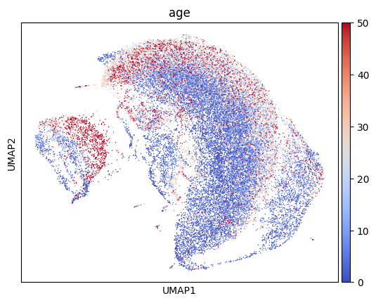
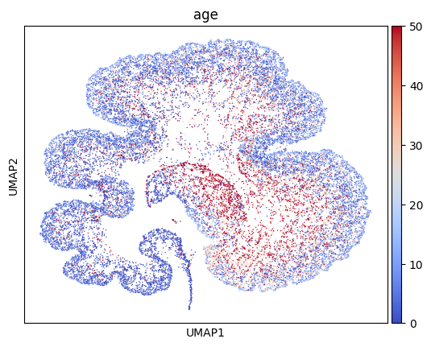

Visualization
=============

Popular tools like `t-SNE`_ and `UMAP`_ can produce intuitive and appealing
visualizations. However, since they perform opaque non-linear transformations of
the input data, it can be unclear how to "tweak" the visualization to
accentuate a specific aspect of the input. Also, it can can sometimes
be difficult to understand which features (e.g. genes) of the input were most important to getting
the plot.

Schema can help with both of these issues. With scRNA-seq data as the primary
modality, Schema can transform it by infusing additional information into it
while preserving a high level of similarity with the original data. When
t-SNE/UMAP are applied on the transformed data, we have found that the
broad contours of the original plot are preserved while the new
information is also reflected. Furthermore, the relative weight of the new data
can be calibrated using the `min_desired_corr` parameter of Schema.

Ageing fly brain
~~~~~~~~~~~~~~~~

Here, we tweak the UMAP plot of `Davie et al.'s`_ ageing fly brain data to
accentuate cell age.

First, let's get the data and do a regular UMAP plot.

.. code-block:: Python

    import schema
    import scanpy as sc
    import anndata
    
    def sc_umap_pipeline(bdata):
        sc.pp.pca(bdata)
	sc.pp.neighbors(bdata, n_neighbors=15)
	sc.tl.umap(bdata)
	sc.pl.umap(bdata, color='age', color_map='coolwarm')

	
.. code-block:: Python
    
    adata = schema.datasets.fly_brain()  # adata has scRNA-seq data & cell age
    sc_umap_pipeline(adata)

This should produce a plot like this, where cells are colored by age. Note
how the age does not look to be a defining feature of the plot:

Next, we apply Schema to infuse cell age into the scRNA-seq data, while preserving a high level of correlation with the original scRNA-seq distances.

.. code-block:: Python

    sqp = schema.SchemaQP( min_desired_corr=0.99, # require 99% agreement with original scRNA-seq distances
		           params= {'decomposition_model': 'nmf', 'num_top_components': 20} )
		    
    mod_X = sqp.fit_transform( adata.X, [ adata.obs['age'] ])  # correlate the gene expression with the 'age' parameter
    mod_adata = anndata.AnnData(mod_X)
    mod_adata.obs['age'] = adata.obs['age']
    sc_umap_pipeline(mod_adata)
    
    diffexp_gene_wts = sqp.feature_weights() # get a ranking of genes important to the alignment
    
This produces a plot like the one shown below. Note how cell-age now stands out more in the plot. We also encourage you to try out other choices of `min_desired_corr` (e.g., 0.999 or 0.7) which will show how the plot changes gradually, as greater distortion of the primary modality is allowed. This example also illustrates Scehma's interpretability. The variable `gene_wts` identifies the genes most important to aligning scRNA-seq with cell age. As we describe in our `paper`_, these genes turn out to be differentially expressed between young cells and old cells.

.. _Davie et al.'s: https://doi.org/10.1016/j.cell.2018.05.057
.. _paper: https://doi.org/10.1101/834549
.. _t-SNE: https://lvdmaaten.github.io/tsne/
.. _UMAP: https://umap-learn.readthedocs.io/en/latest/
